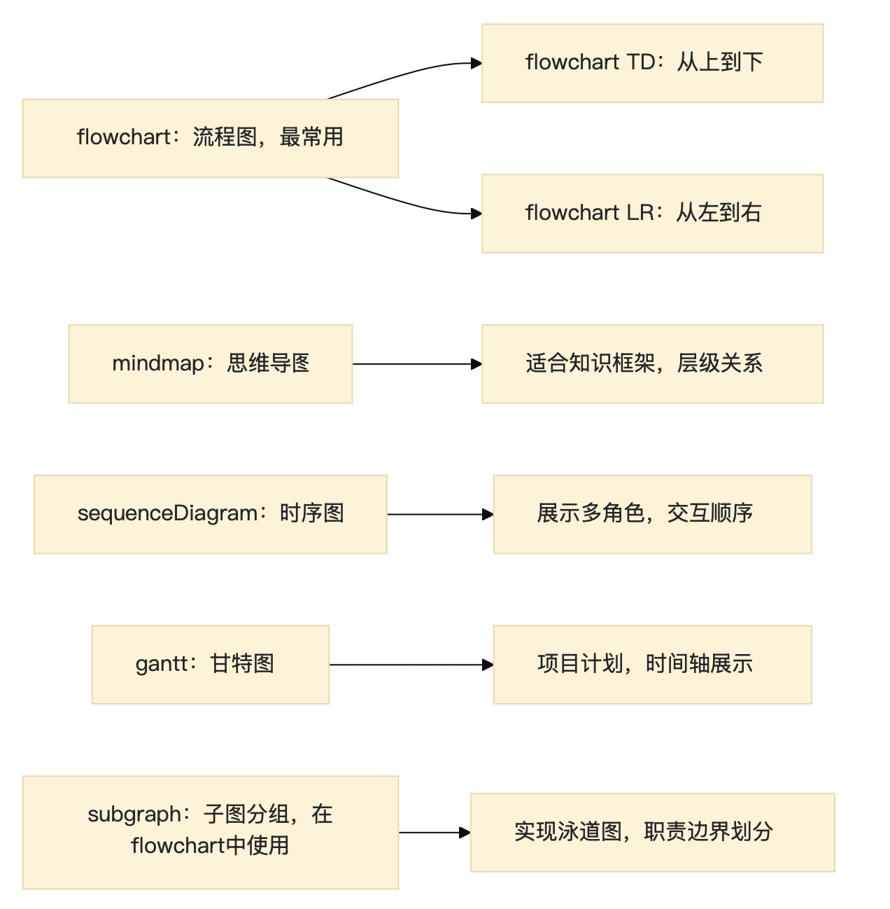
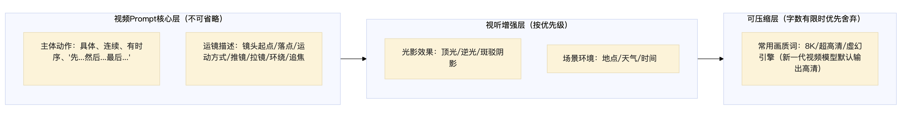
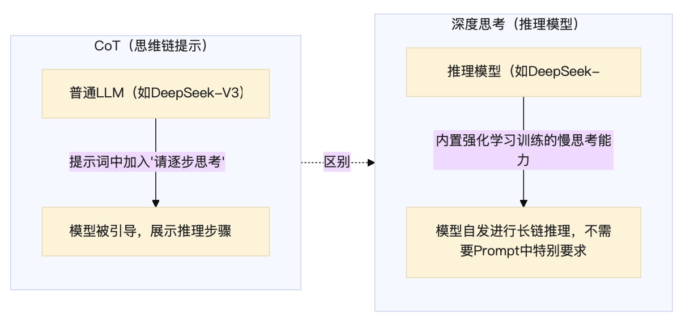
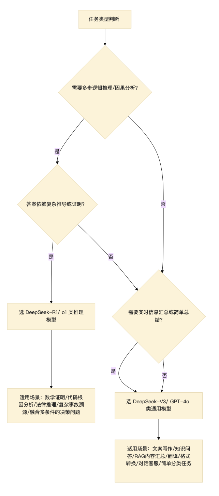

# Prompt 设计与多模态应用

## 文生文(Text-to-Text)进阶提示策略

### 清晰的说明与答案结构

**任务边界的精准界定**是高质量文生文Prompt的基础。一个任务边界不清的Prompt会给AI留下大量"自由发挥"空间，导致输出方向发生偏移。边界界定应覆盖：目标受众、内容范围、不应涉及的领域、输出格式、期望长度

**答案结构的预设**：在Prompt中预先为AI定义输出的结构框架，比描述性指令更有效。常见结构预设方式：

- 列明必须包含的章节（"请依次给出：背景分析、核心诉求、解决方案、风险预估"）
- 提供结构化模板（"使用以下格式：【结论】... 【原因1】... 【原因2】... 【行动建议】..."）
- 明确分点数量（"请给出3点且仅3点最关键的理由"——有效防止AI无限发散）

### 提示词符号的使用

符号是Prompt中的"语法标点"，用于区分不同功能区域、标注层级关系和强调重要内容：

| 符号/语法                  | 用途                         | 示例                                     |
| :------------------------- | :--------------------------- | :--------------------------------------- |
| `###` 或 `---`             | 分隔不同的内容区块           | `### 背景信息 ### 任务指令`              |
| `**粗体**`                 | 强调关键要求或禁止事项       | `**必须**包含案例，**禁止**引用过时数据` |
| `<xml_tag>...</xml_tag>`   | 包裹用户提供的数据，防止注入 | `<document>此处放入合同文本</document>`  |
| `"""..."""` 或 ````...```` | 包裹代码块或文本示例         | 提供Few-Shot示例时                       |
| `[占位符]`                 | 强制模型填充的结构化槽位     | `[在此处插入数据可重复性声明]`           |
| 编号列表`1. 2. 3.`         | 明确步骤顺序或优先级         | 描述工作流程或分析步骤                   |

**占位符（Placeholder）的工程价值**：对于必须出现在输出中的特定章节（如"数据可重复性声明"、"风险提示"），在Prompt中使用占位符强制结构是最可靠的工程方案。相比于"请在文末添加数据可重复性声明"这类祈使句，占位符直接将格式硬编码进生成流，模型必须按槽位填充，失败率极低。

### 零样本(Zero-Shot)与少样本(Few-Shot)提示

**零样本提示（Zero-Shot Prompting）**：不提供任何示例，仅靠描述性指令让模型完成任务。优点是简洁快速；缺点是对"隐性风格要求"（如特定平台写作腔调）描述力有限，适合模型本身擅长且规格标准的通用任务

**少样本提示（Few-Shot Prompting）**：提供1~5个"输入→输出"的完整示例，让模型通过模仿示例来理解任务要求。Few-Shot是解决风格迁移问题的最强工具——当你需要的风格无法用文字精确描述时（如特定平台的"网红腔"、某位大师的写作风格），直接提供示例效果远优于反复描述风格特征

**思维链少样本（Few-Shot CoT，Chain-of-Thought）**：在示例中不仅给出"输入→输出"，还展示中间的完整推理步骤（"输入→思考过程→输出"）。这对于需要多步推理的复杂任务（数学、逻辑分析、风险评估）有显著提升效果，因为模型通过模仿示例中的推理链路，被引导做出更严谨的逐步推导

> 对推理模型的推荐策略：**优先使用Zero-Shot**；若使用Few-Shot，示例中必须包含完整的CoT推理过程，而非仅有最终答案。

### 通过Prompt引导外部工具调用

当任务涉及专业数据处理、实时信息或精确计算时，应在Prompt中明确引导AI调用外部工具：

**代码解释器（Code Interpreter）**：需要处理数据计算时，应引导AI编写并执行代码，而非尝试"心算"。示例提示词：

```
用户上传了一个包含10万行销售记录的CSV文件。
请用Python的pandas库：
1. 筛选出华东大区2025年Q3季度"无线耳机"品类的所有记录
2. 计算总销售额和平均客单价
3. 将结果以表格形式输出
请直接编写代码并执行，不要试图手动计算。
```

**Web搜索/知识检索**：需要实时信息时，明确要求AI使用搜索工具而非依赖训练数据中可能过时的知识

### 结构化图形生成：Mermaid语法



## 文生图(Text-to-Image)提示词设计方法

文生图Prompt的核心设计逻辑是：**将脑海中的视觉意象，分解为图像模型能理解的参数化描述**。基于扩散模型架构（Stable Diffusion、即梦AI等）的图像生成，高度依赖Prompt词语的位置权重——**靠前的描述获得更高的注意力权重**，主体描述应前置

### 主体描述(Subject)

精准界定画面的核心对象，一般需覆盖：

- **身份/物种**：人物（年龄、性别、职业）、动物（种类）、物体（品类、型号）
- **外形细节**：人物需包括体型、发型、面部特征（如酒窝、眼神）、服饰款式和材质
- **数量、姿态**：明确主体数量，描述站立/坐/奔跑等具体姿态

**语序权重原则**（重要）：Diffusion架构模型对Prompt前部的词语赋予更高关注度。若主体描述写在提示词后半段，主体特征容易被前文的场景描述稀释，导致主体在图中占比过小或细节丢失。**正确做法：主体描述置于Prompt最前端**

示例（正确写法）：

```
满是凝结水珠的冰凉饮料瓶特写，瓶身清晰可见，前景主体占画面70%，
背景是模糊的夏日海滩，浅焦背景虚化，清新夏日氛围
```

### 场景描述(Scene)

构建主体所处的三维空间环境：

- **地理与空间**：具体地貌（沙漠绿洲/工业厂房/哥特教堂中殿）、室内外、开阔/封闭
- **时间与气候**：季节（飘落樱花的早春）、时刻（蓝调时刻的黄昏）、天气（雾霾/暴雨/晴空）
- **空间层次**：前景、中景、背景的元素分别描述，有助于构建景深感

### 风格化控制(Style)

风格控制决定图像的艺术语言，分多个维度：

| 维度         | 示例词汇                                                     |
| :----------- | :----------------------------------------------------------- |
| **艺术流派** | 写实主义、印象派、超现实主义、新艺术运动、赛博朋克、水墨风格 |
| **技术手法** | 3D渲染、水彩手绘、版画印刷、像素艺术、矢量插画、胶片质感     |
| **色彩调性** | 莫兰迪色系、高饱和赛博朋克配色、冷色调、暖橙色调             |
| **质感表现** | 哑光、金属镜面、丝绒质感、宣纸颗粒感                         |
| **参考大师** | 宫崎骏动画水彩质感、梵高厚涂笔触、卡拉瓦乔明暗对照           |

**示例："AI塑料感"的解决方案**：AI生成的人像常出现皮肤过于光滑、毫无瑕疵的"橡胶娃娃感"。解决方法是**主动描述肌肤的真实细节**：加入"皮肤纹理、毛孔、雀斑、细纹"等关键词，同时加入"胶片颗粒感（film grain）"来引入自然噪点。这与堆砌"8K超高清/超精细"等画质词相反——后者会让AI更积极地去噪平滑，反而加剧塑料感

### 镜头语言(Lens/Camera)

模拟摄影器材的光学特性，为AI提供空间布局指引：

| 镜头语言要素          | 说明                                                     | 效果                                                   |
| :-------------------- | :------------------------------------------------------- | :----------------------------------------------------- |
| **景别**              | 特写/中景/全景/大远景/航拍                               | 控制主体在画面中的占比与信息量                         |
| **视角**              | 平视/仰视/俯视（俯拍）/鸟瞰                              | 仰视增强崇高感，俯视展现全局                           |
| **焦距效果**          | 微距（超近细节）/长焦（压缩背景）/广角（宏大场景）       | 影响空间感和景深                                       |
| **鱼眼镜头**          | 超广角，画面中心正常，边缘强烈弯曲内凹，产生球形畸变     | 增强视觉张力，但不产生速度感（动感模糊才是速度的关键） |
| **追焦/动态模糊**     | 主体清晰，背景呈现方向性拉丝                             | 表现速度感（赛车、奔跑）的核心技法                     |
| **景深（浅焦/深焦）** | 浅焦：主体清晰+背景虚化（焦外散景Bokeh）；深焦：全景清晰 | 浅焦突出主体，深焦展现场景全貌                         |

> **示例：速度感的表达**：表现赛车或奔跑的速度感，核心技法是**追焦（Panning Shot）+ 动态模糊（Motion Blur）**——主体本身保持相对清晰，背景呈现横向拉丝。单纯的"超高清/锐利"反而会让画面看起来像静止定格。鱼眼镜头增加视觉张力但不直接制造速度感，需配合动态模糊。

### 光影设置(Lighting)

光影是决定图像情绪和质感的关键要素：

| 光影效果                       | 适用场景                                   |
| :----------------------------- | :----------------------------------------- |
| 丁达尔光（Tyndall Effect）     | 林间/仓库/窗缝的光束，温暖、神圣感         |
| 逆光（Backlit）                | 剪影效果，艺术感强                         |
| 伦勃朗光（Rembrandt Lighting） | 人像摄影：侧面一道三角形光斑，经典戏剧质感 |
| 霓虹灯光                       | 城市夜景、赛博朋克风格                     |
| 柔光（Soft Light）             | 美食、产品摄影，减少硬阴影                 |
| 强烈顶光（Harsh Top Lighting） | 正午阳光，树叶投下斑驳阴影                 |

### 垫图(Image-to-Image)的使用逻辑

垫图是将一张参考图像作为"结构先验"输入，引导文生图模型在生成新图时参考原图的构图、色彩或主体形态。

| 重绘幅度                 | 模型行为                                 |
| :----------------------- | :--------------------------------------- |
| 低重绘幅度               | 强烈保留原图结构，只微调色彩或纹理       |
| **中等重绘幅度**（默认） | 原图提供结构骨架，文本引导内容和风格修改 |
| 高重绘幅度               | 原图仅提供松散参考，文本主导生成         |

多模态冲突（垫图与文本语义冲突）：当垫图内容（如白色飞机）与文本描述（绿色游艇）产生语义矛盾时，在中等重绘幅度下，模型无法完全服从任何一方——通常表现为：原图形状（白色飞机）被保留，但颜色和部分纹理向文本描述（绿色、游艇纹理）妥协，产生"绿色苹果"或"苹果形状的梨"这类混合结果。这是扩散模型在条件冲突时的典型行为模式

### 局部重绘(Inpainting)

局部重绘是解决图像局部问题的精准工具：使用画笔遮罩精确覆盖需要修改的区域，仅重新生成遮罩内的内容，其余区域完全保持原样

使用场景：修复局部模糊区域（如海报上文字不清晰）、替换背景中的特定元素、生成特定区域的高清细节

局部重绘的核心优势：**画笔选区提供空间约束 + 局部Prompt提供内容引导**，两者结合，使AI的修改精确定位在指定区域，同时保证与周边内容的无缝融合

### 视觉问题的诊断框架

| 问题表现                | 根因诊断                        | 正确的修正方向                                               |
| :---------------------- | :------------------------------ | :----------------------------------------------------------- |
| 主体太小/构图不对       | 主体描述靠后 / 镜头语言描述缺失 | 主体前置 + 明确景别（特写/全景）                             |
| 没有速度感              | 缺少追焦/动态模糊描述           | 加入"追焦、运动模糊、背景拉丝"描述                           |
| 人像"AI塑料感"          | 皮肤过度平滑、缺少真实纹理      | 加入"毛孔、雀斑、胶片颗粒感"等真实纹理词；**减少"8K超高清"等去噪词** |
| 产品换背景后"悬浮感"    | 主体与新环境无光影/反射交互     | 先智能抠图，再做场景合成，并在Prompt中描述"地面反光、环境光色温与主体一致" |
| 大面积内容缺失/结构损坏 | GAN无法重建全局语义             | 换用Diffusion模型/局部重绘                                   |

> **示例：产品换背景的工作流**：不应让模型"在一轮图生图里同时重建产品和背景"。正确流程是：① 智能抠图保留产品主体 → ② 单独生成新场景背景 → ③ 场景合成时描述光影与产品的交互细节（如地面投影、反射光）。这样能最大程度保留产品Logo/外形，同时使合成结果自然融合

## 视频与数字人生成的提示词设计

### 视频Prompt的核心元素

视频生成与静态图像生成的本质差异在于：视频有**时间维度**，需要描述"在时间序列上发生了什么"



**优先级原则**：在提示词字数有限时，**"主体动作描述"和"运镜语言"**的优先级最高，因为这两类信息是视频模型最核心的内容控制维度。"通用画质词"（如"8K分辨率、虚幻引擎5渲染、大师级作品"）的优先级最低——当代主流视频大模型（如可灵、即梦）经过高质量数据微调，默认输出即为高清质量，过多堆砌质量词只会稀释核心语义权重，且被模型视为语义噪音

### 运镜语言(Camera Movement)

| 运镜术语                       | 描述                       | 效果                         |
| :----------------------------- | :------------------------- | :--------------------------- |
| 推镜（Push In / Zoom In）      | 镜头向主体逼近             | 突出主体，制造张力           |
| 拉镜（Pull Out / Zoom Out）    | 镜头从主体后退             | 揭示环境，营造孤独感         |
| 摇镜（Pan）                    | 镜头左右平移，相机位置不动 | 展现横向空间关系             |
| 移镜（Track / Dolly）          | 相机沿轨道物理移动         | 真实感更强，有"随行"感       |
| 环绕（Orbit）                  | 镜头绕主体旋转             | 全方位展示主体，适合产品展示 |
| 跟镜（Follow / Tracking Shot） | 镜头跟随主体移动           | 强代入感，动感强             |

### 主体动作描述的最佳实践

对比三种描述主体动作的写法：

- ❌ 抽象描述："武士练剑，姿势有力"（模型无法理解具体动作序列）
- ✅ 动作序列化："武士双手持刀高举，先静止片刻；随后面部肌肉紧绷，猛然向下挥砍，刀刃划破空气"
- ✅ 时间标注法（15秒以内的短片效果最佳）："第0-3秒：特写镜头聚焦武士的脚，地面扬起尘土；第3-8秒：镜头快速向后拉升仰视，樱花树全景出现；第8-15秒：武士挥剑，花瓣随气流飞散"

### 视频风格的统一与连贯性控制

保持系列视频风格一致的技巧：

1. **固定核心描述**：在每个片段的Prompt中，保持对主体的外观描述（服装、发型、特征）完全一致，只改变场景和动作
2. **使用参考图/首帧图**：将系列视频第一帧的截图作为垫图输入，使后续片段的主体外观与第一帧对齐
3. **锁定画面风格词**：将艺术风格（如"水彩动画风格、柔光"）固定在每段Prompt的相同位置，防止模型在不同片段间切换风格

> **关于固定Seed的常见误区**：固定相同的随机种子（Seed）并不能在**完全不同的提示词和分镜**中保证风格统一——Seed控制的是初始噪声，当Prompt内容差异较大时，不同的噪声路径会产生截然不同的构图和光影，反而可能导致各片段之间视觉风格更加混乱。正确的风格统一方法是上述第1、2、3点（固定描述 + 参考图 + 风格词），而非依赖Seed

### 数字人核心技术栈

**全天候无人值守数字人**（如直播数字人、客服数字人）与传统视频数字人的技术架构根本不同：

| 技术层 | 组件                                      | 作用                                             |
| :----- | :---------------------------------------- | :----------------------------------------------- |
| 理解层 | LLM（大语言模型）                         | 意图识别与智能回复生成                           |
| 语音层 | TTS（Text-to-Speech）                     | 将回复文本实时合成为自然语音                     |
| 表情层 | 音频驱动口型技术（Audio-Driven Lip Sync） | 根据音频波形实时驱动数字人的嘴型、表情和头部动作 |

这条链路实现了"听懂问题→生成回答→合成语音→驱动面部"的端到端实时交互。**数字人的回答内容是实时由LLM生成的**

## 带深度思考模型的提示方法

### 深度思考与思维链的概念与区别

**思维链（Chain of Thought，CoT）**：通过在Prompt中要求模型展示推理步骤（"请逐步思考"），引导模型在给出最终答案前先生成中间推理过程。CoT是一种提示技术，可应用于任何语言模型

**深度思考（Deep Thinking / Reasoning）**：指以DeepSeek-R1、OpenAI o1/o3为代表的推理模型所具备的内置"慢思考"能力。这类模型通过强化学习（RL）训练，学会了在回答前自发进行大量内部推理（模型内部会生成大量"思维草稿"，最终只向用户展示精炼后的答案）



**关键区别**：CoT是一种**提示技术**，需要用户在Prompt中主动触发；深度思考是推理模型通过特殊训练获得的**内置能力**，使用时不需要在Prompt中加入特殊指令（反而不建议写"请一步一步思考"，因为推理模型已经会自动这样做）

### 深度思考模型(R1/o1类)与普通模型的选择策略



**推理模型不应使用的场景**（重要）：在RAG系统末端做简单文档汇总、翻译、格式转换等不需要复杂推理的任务时，不应使用推理模型——这会显著增加响应延迟和Token消耗，并可能因模型"想太多"而对简单内容进行过度分析，反而产生幻觉或答非所问

### 深度思考模式下的参数配置

| 参数          | 通用模型推荐                       | 推理模型推荐                 | 原因                                                         |
| :------------ | :--------------------------------- | :--------------------------- | :----------------------------------------------------------- |
| Temperature   | 0（精确任务）/ 0.7~1.0（创意任务） | 0.5~0.7                      | 推理模型Temperature=0时极易在长思维链生成中陷入"重复循环"，适度随机性帮助跳出推理死胡同 |
| Top-P         | 0.9~1.0                            | 0.95~1.0（默认）             | 推理模型不建议限制采样空间                                   |
| System Prompt | 可写详细指令                       | 简洁为主（避免指导如何思考） | OpenAI/DeepSeek官方警告：推理模型自带强大的内在思维链。不要在Prompt中强加“请一步步思考”或硬性规定推理框架，多余的指导反而会限制其原生推理能力。 |
| Few-Shot示例  | 非常有效，推荐                     | 尽量不使用                   | OpenAI/DeepSeek明确建议移除Few-Shot。如果给出的示例只包含“问题+直接答案”（无CoT），推理模型会过度模仿示例，直接跳过内置思考过程，导致性能断崖式下跌。 |

### 深度思考中的清晰说明与答案结构

推理模型的性能高度依赖**Prompt的清晰程度**。以下几类歧义会严重干扰推理链的稳定性：

- **时间范围歧义**："分析AI对就业的长期影响" → 应明确"长期=10年以上"
- **范围边界歧义**："分析市场情况" → 应明确地理范围（全球/国内/特定地区）和行业范围
- **评判标准缺失**：数学证明类任务应明确"证明需要满足的严格条件"

**推荐结构**：对推理模型提出的任务应尽量采用"论点-论据-结论"的三段式框架，并在Prompt中预先声明期望的答案结构（如"请按照：①问题本质界定 ②分步推导 ③结论与验证 的结构作答"）

## 提示词优化

### Token节省策略

Token是大语言模型的计费和长度单位，精简Prompt有助于降低成本、提升效率：

- **去除客套语**：开门见山，避免"你好，请帮我..."等无效前缀
- **合并冗余说明**："请详细地、完整地、全面地分析" → "请全面分析"
- **使用简洁符号代替文字**：用`###`分隔代替"以下是背景信息，请认真阅读："
- **指定长度约束**：明确"回复控制在300字内"，防止模型生成冗余内容
- **缩短Few-Shot示例**：示例只需覆盖核心格式要素，不必包含完整的长篇范文

### 输入结构化

结构化输入能大幅提升模型的理解效率：

- **分段标注**：使用`### 背景 ###`、`### 任务 ###`、`### 约束 ###`等明确标注每段信息的类型
- **多项要求编号**：将"请帮我写文案，要活泼，包含表情，不超过100字，含标签"改为有序列表，减少解析歧义
- **关键信息前置**：将最重要的约束或任务目标写在Prompt的最前面，利用模型对前部内容的更高关注度

### 输出格式控制

精确控制输出格式是确保Prompt结果可用于下游系统的关键：

**结构化输出（JSON/XML）**：当AI输出需要被程序解析时，必须要求JSON格式输出，并在Prompt中说明JSON的Schema（键名和类型）：

```
请以JSON格式输出，结构如下：
{
  "status": "通过/拒绝",
  "score": 数字0-100,
  "reason": "简短理由（50字以内）"
}
```

**长度控制**：宽泛的长度要求（"简短回答"）效果不如具体数字限定（"不超过150字"）。对输出条数也应明确：

- "列出优点" → "列出3-5点优点"
- "给出建议" → "给出按优先级排序的3条建议"

**格式稳定性的最优方案**：对于必须包含特定章节或字段的输出，**在Prompt中直接嵌入含占位符的结构模板**是最可靠的工程方案：

```
请按以下模板完整填写，不得省略任何部分：

## 研究背景
[在此处填写背景说明，100-150字]

## 实验方法
[在此处描述方法，100-150字]

## 数据可重复性声明
[在此处填写数据可获取方式和重复步骤]
```

这种方式通过"占位符强制模型填充"，将格式硬编码进生成流，远比祈使句指令（"请在文末添加数据可重复性声明"）更可靠