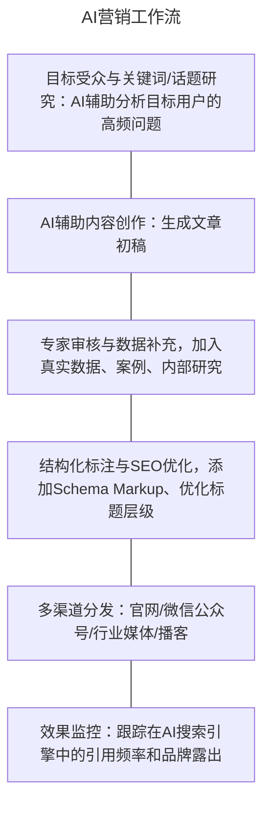

# AI 工作流与商业成果落地

## 写作与文案创作

### 写作风格一致性控制

在长篇写作（报告、系列文章、品牌文案）中，最大的挑战之一是保持风格的跨段落乃至跨对话的一致性

**三种风格对齐方法**（按效果排序）：

1. **提供风格示例（Most Effective）**：在Prompt开头粘贴2-3段目标风格的范文，指令："请以上述示例的风格（非文本内容）为基础，撰写......"
2. **风格关键词等抽象描述**：精炼出风格的核心特征词（如"理性严谨/拒绝口语化/多用数据佐证/结论先行/段落控制在150字内"）
3. **建立风格卡片（Style Card）**：将完整风格描述写为一个可复用的System Prompt或提示词模块，在版本管理工具中维护，每次使用时调用

**风格一致性检查提示词示例**：

```
以下是一篇已完成的文章片段（参考风格）：
[粘贴已确认风格的样本段落]

现在请以完全相同的风格（语气、句子结构、
用词选择、段落长度）续写下一章节：
[在此处输入新章节的主题和要点]
```

### 翻译策略：信达雅

"信达雅"是中国翻译界的经典三层次标准，由严复提出，在AI翻译工作流中具有重要的实践价值：

| 层次                     | 含义                         | AI翻译对应策略                                           |
| :----------------------- | :--------------------------- | :------------------------------------------------------- |
| **信（Faithfulness）**   | 忠实于原文信息，不增不减     | 字面直译，不做主观增删；先完成"信"的骨架                 |
| **达（Expressiveness）** | 通顺自然，符合目标语言习惯   | 对直译结果进行流畅性润色；用地道表达替换生硬直译         |
| **雅（Elegance）**       | 文辞优美，体现原文的文学质感 | 修辞提升，保留原文隐喻和语言风格；适配目标受众的审美偏好 |


**专业术语翻译的注意事项**：AI在翻译合同、专利、医学文档等专业文本时，必须在Prompt中明确：

- 禁止在正式术语上"意译创造"新词，要求使用领域标准译法
- 关键术语第一次出现时保留原文对照（如"不可抗力（Force Majeure）"）
- 对数字、单位、缩写进行逐一核对，不允许自动转换

**思维源语污染（Language Thinking Contamination）**：当System Prompt用英文撰写、任务内容是中文、而输出目标是法语时，模型可能沿英语思维路径组织法语，导致输出带有明显的英语翻译腔，而非地道法语表达。这种"多语言框架碰撞"现象称为**思维源语污染**。应对方法：**输入指令的语言尽量与目标输出语言一致或相近**；避免在同一Prompt中混用多种语言建立不同的语义框架

**核心关键词锚定**：商业文案中，若品牌希望全文围绕一个核心卖点（如"控油"），需在Prompt中明确做关键词锚定——要求关键段落围绕"控油时长""控油场景""控油效果"等子主题展开。这是防止模型写着写着偏离核心卖点的有效工程手段

### 长篇文章与报告的AI工作流

**AI不擅长"一次生成整篇长文"**（重要共识）：直接让AI写一份2万字报告，往往会得到结构混乱、重复内容多、后段质量明显下滑的结果。正确方法是将长文拆分为层级写作任务：


**关键原则**：每一步中"[人]"的工作不可省略。长文写作中的人工审核节点（Human-in-the-loop）确保了最终交付物的质量和方向正确性，AI只是加速工具，而非完全替代人的创作能力

## 视觉与多媒体内容创作

### PPT的AI全流程制作


**VBA方案（嵌入PowerPoint的自动化脚本）**：

- 优点：直接操作PPT文件，无需第三方平台；完全可控；适合需要大量页面或复杂动画的场景
- 操作方式：要求AI生成一段VBA宏代码，在PowerPoint的"开发者工具→宏→编辑"中粘贴运行，即可自动创建符合大纲的多页PPT框架

**Markdown转PPT方案**：

- 使用Marp、Slidev等工具，Prompt指令格式为：

```
请将以下内容转换为Marp格式的Markdown PPT：
## 主题：...
每页内容控制在60字以内
使用---分隔每页
共计约15页
[在此处填入报告内容]
```

### 图像/视频的AI批量处理

**批量一致化处理场景**：品牌方需要对500张产品图进行特定风格统一（如将不同背景的商品图全部换成白色无影棚背景），处理步骤：

1. 建立参考图（一张标准背景的样板图）
2. 写批量处理Prompt（含智能抠图+背景合成指令）
3. 通过ComfyUI/API工作流批量处理

**视频配音工作流**：AI生成语音 → AI转录校对字幕 → 合并时间码 → 一键渲染

## 数据与逻辑工作流

### 代码解释器(Code Interpreter)

代码解释器是AI处理数据任务的核心工具，它允许AI直接编写并执行代码，对用户上传的数据文件进行真实计算

**标准数据分析工作流**：

```
用户提供：包含12个月销售数据的Excel文件（50列，10000行）
任务Prompt：
"请分析这份销售数据，完成以下任务：
  1. 计算各大区（华北/华东/华南/西部）的年度总销售额和增长率
  2. 找出销售额Top 5的产品SKU及其占总销售额的比例
  3. 绘制月度趋势折线图（各大区分色）
  4. 生成一份包含上述结论的200字数据摘要
请使用Python Pandas执行计算步骤1-2，使用Matplotlib绘制图表。"
```

代码解释器相比纯自然语言分析的核心优势：**消除幻觉**——AI尝试"心算"大型数据集时，不可避免地会产生不准确数字（这是幻觉的主要来源之一）；代码解释器直接执行计算，结果来源于真实运算，数学上完全可靠

**常用的Python数据分析工具**（AI会选择调用）：

- `pandas`：数据清洗、分组聚合、透视表、时间序列
- `matplotlib` / `seaborn`：数据可视化
- `openpyxl` / `xlrd`：直接读写Excel文件

### AI辅助文档逻辑分析

**合同/协议审查**：向AI提供完整合同文本后，Prompt指令：

```
请审查这份合同，重点检查：
① 是否存在对甲方不利的条款（尤其是违约责任、赔偿上限、单方面修改权）
② 是否有表述模糊或可能产生争议的条款
③ 是否遗漏了通常合同中必须包含的保护条款
请以"条款编号 → 风险等级（高/中/低） → 风险说明 → 建议修改方向"的格式输出
```

**报告/论文逻辑校验**：

```
请检查这篇论文的论证逻辑，重点检查：
① 各章节的中心论点是否前后一致
② 支撑论据是否充分（是否存在"仅靠断言无据"的情况）
③ 结论是否与前文的分析和数据相符
```

### RPA与动态网页数据采集

**RPA（Robotic Process Automation，机器人流程自动化）** 是通过软件机器人模拟人工操作计算机界面（点击、输入、截取）来执行重复性业务流程的技术，常用于数据采集、报表填报、系统对接等场景

**动态网页采集的关键认知**：现代网页大量使用JavaScript前端框架（React/Vue/Angular），页面内容不在HTML源代码中，而是在浏览器执行JavaScript后动态渲染出来的。这意味着：

- ❌ 直接抓取HTML源代码：拿到的是JavaScript代码而非实际数据，数据为空
- ✅ 使用RPA工具或无头浏览器（Headless Browser，如Playwright/Puppeteer）：让浏览器真实渲染页面，等待JavaScript执行完毕，数据呈现在界面元素后再抓取

**工程判断原则**：遇到"网页抓不到数据"的场景，首先判断是否为动态渲染页面——而不是调整爬虫速度或更换IP

### Excel数据清洗：格式与类型的区别

**区别示例**：

| 操作                                 | 本质                         | 对计算的影响                                 |
| :----------------------------------- | :--------------------------- | :------------------------------------------- |
| 修改单元格显示格式（如"短日期格式"） | 只改变视觉呈现，底层数据不变 | **无效**：透视表、分组、统计仍按原始类型处理 |
| 将文本转换为日期/数字类型            | 改变底层数据类型             | **有效**：透视表、SUMIF、分组才能正确执行    |

**为什么重要**：一列混乱日期（如"2025/1/5"、"Jan 5, 2025"、"20250105"等不同格式混杂）在显示上改成统一的"短日期格式"后，视觉整齐，但底层依然是字符串。此时进行透视分析或按月分组，结果要么报错要么完全错误。正确做法是要求AI生成数据类型转换代码（如Python的`pd.to_datetime()`），而不仅仅是用Excel格式刷

### 异常值识别与VLOOKUP常见误区

**异常值识别的统计方法**：传感器数据中出现-999、9999这类极端值时，最严谨的处理方式是用统计学规则识别离群值：

- **IQR方法（四分位距法）**：计算Q1（25%分位数）和Q3（75%分位数），将低于`Q1-1.5×IQR`或高于`Q3+1.5×IQR`的值标记为异常
- **3σ原则**：将距均值超过3倍标准差的值标记为异常

> 不应凭直觉"手工删掉感觉异常的值"——主观判断会引入人为偏差，且当数据量大时无法规模化执行。应让AI生成统计异常值检测代码，再对识别出的异常记录进行业务判断（是传感器故障还是真实极值）

**VLOOKUP近似匹配的常见误区**：在Excel中，`VLOOKUP`的第四参数设为`TRUE`（近似匹配）并**不等于**文本模糊匹配。其工作原理是：

- `TRUE`近似匹配：要求查找列**已升序排序**，在排序后的区间内按"不超过查找值"的最大值匹配——本质是按数值区间查找
- 它**无法**解决"Apple Inc."与"apple"、"苹果公司"的文本相似匹配问题

面对企业名称、产品SKU的模糊匹配，正确方案是：先做规范化清洗（统一大小写、去除特殊字符），再使用文本相似度算法（如编辑距离）或Embedding语义相似度匹配

## AI辅助变成与Vibe Coding

### 代码生成(Code Generation)

AI在代码生成场景下的核心价值：快速生成功能原型、补全重复性代码、跨语言翻译。

**高质量代码生成Prompt的四要素**：

1. **语言和框架**：明确指定（Python + FastAPI / JavaScript + React / SQL + PostgreSQL）
2. **功能描述**：精确描述函数的输入、输出、边界条件
3. **代码风格要求**：变量命名规范、注释语言、是否需要类型注解
4. **约束条件**：不使用特定库、兼容Python 3.9+、代码控制在50行内

示例（优质的代码生成Prompt）：

```
请用Python（3.10+）编写一个函数：
- 函数名：parse_sales_csv
- 输入：CSV文件路径（字符串）
- 输出：包含每个产品品类的月度总销售数字
  的字典（格式：{"品类": {"月份": "总额"}}）
- 使用pandas库处理
- 包含对文件不存在和CSV格式错误的异常处理
- 添加中文注释
```

### 代码调试与错误诊断

AI调试代码的最佳实践是提供**完整的错误上下文**：

**调试"三件套"**（缺一不可）：

| 必要信息         | 内容                         | 缺乏后果           |
| :--------------- | :--------------------------- | :----------------- |
| ① 触发报错的输入 | 导致错误的具体输入数据/参数  | AI无法复现问题     |
| ② 完整报错堆栈   | 从终端/IDE复制的完整错误信息 | AI只能猜测错误类型 |
| ③ 出错的代码片段 | 相关函数/文件的完整代码      | AI无法定位错误位置 |

```
以下代码出现了错误：

[粘贴完整的出错代码文件/函数]

触发错误的输入：
[描述或粘贴触发问题的具体输入]

错误信息（复制完整的报错堆栈）：
[粘贴完整的错误栈信息]

请：
1. 解释这个错误的根本原因
2. 提供修复后的代码
3. 说明为什么会发生这个错误，以便我未来避免
```

### 代码重构与可读性优化

代码重构Prompt需要明确改进目标：

```
请对以下Python代码进行重构，目标是提高可读性和可维护性：
要求：
① 将超过20行的函数拆分为功能单一的小函数
② 消除重复代码（DRY原则）
③ 用有意义的变量名替换单字母变量（保留循环变量i、j除外）
④ 不改变原有功能和对外接口

[粘贴原始代码]
```

### Vibe Coding(氛围编程)

**核心理念**：开发者不再精确描述每一个函数或算法，而是用**自然语言描述想要的结果和体验**（即"氛围"），让AI负责实现所有具体代码；开发者只通过观察运行效果、反馈"这不对，那样改"来迭代，完全无需自己编写代码甚至无需理解底层实现


**Vibe Coding 与传统 AI 代码补全的区别**：

| 维度       | 传统AI代码补全（GitHub Copilot等） | Vibe Coding                            |
| :--------- | :--------------------------------- | :------------------------------------- |
| 控制者     | 开发者写代码框架，AI辅助填充       | AI负责全部实现，开发者负责"感受和反馈" |
| 开发者角色 | 工程师（懂代码）                   | 产品经理+测试官（不需要懂代码）        |
| 适用场景   | 专业软件开发                       | 快速原型/个人工具/MVP验证              |
| 代码质量   | 可控                               | 不稳定，随复杂度上升快速衰减           |

**Vibe Coding 的局限性**（客观评估）：当项目规模超过约1000行代码时，AI会开始忘记早期的架构决策，导致代码前后冲突。适合用于：快速验证商业想法、构建个人自动化工具、交互式Demo原型。不适合：涉及数据安全的生产系统、大型团队协作项目、高可靠性基础设施

### AI辅助编程的安全注意事项

AI生成的代码**不具备自动安全能力**，必须进行人工安全审查，重点关注：

- **SQL注入**：确保所有数据库查询使用参数化查询，而非字符串拼接
- **XSS（跨站脚本）**：前端代码应对用户输入进行HTML转义
- **硬编码密钥**：AI有时会将密钥直接写入代码，生产代码必须改用环境变量
- **过度权限**：AI生成的IAM角色或数据库权限配置常设为"最大权限"，需最小化原则复审

## AI营销与GEO

### SEO与GEO的概念与区别

**SEO（Search Engine Optimization，搜索引擎优化）**：通过优化网页内容、技术结构和外部链接，提升在Google/百度等传统搜索引擎的自然搜索排名，获取流量。SEO的核心对象是**搜索引擎的爬虫与排名算法**

**GEO（Generative Engine Optimization，生成式引擎优化）**：通过优化内容的结构、权威性和可引用性，使内容在以AI为核心的搜索引擎（如Perplexity、ChatGPT搜索、Gemini、必应AI搜索）的生成式答案中被**引用、摘录或推荐**。GEO的核心对象是**大语言模型的内容理解与引用机制**

**核心差异对比**：

| 维度     | SEO                        | GEO                                |
| :------- | :------------------------- | :--------------------------------- |
| 优化对象 | 搜索引擎排名算法           | LLM的理解与引用机制                |
| 流量类型 | 点击量（直接流量）         | 被引用/推荐（品牌曝光 + 间接流量） |
| 核心指标 | 关键词排名、点击率         | 在AI答案中的引用频率、品牌露出     |
| 内容形式 | 关键词密度优化、长尾词覆盖 | 直接回答式、数据权威型、结构清晰   |
| 时效性   | 排名建立需数周至数月       | 高质量内容被LLM索引后可较快见效    |

### GEO的核心策略

**策略一：权威性内容（Authoritative Content）**

LLM在生成答案时，倾向于引用来自可信来源的内容（学术机构、行业报告、知名媒体）。GEO内容应体现权威信号：

- 署名可信的专家/机构
- 引用可追溯的数据来源
- 提供深度分析而非简单摘抄

**策略二：直接回答式内容结构（Answer-First）**

传统SEO内容为了提高篇幅会大量铺垫，但LLM更倾向引用那些**开门见山直接回答问题的内容**。GEO内容应：

- 在文章开头即提供核心答案（结论先行）
- 使用FAQ格式明确问答
- 将每个段落的主旨写在段落首句

**策略三：结构化标注（Structured Data）**

- 使用Schema.org的结构化数据标注（JSON-LD格式），帮助LLM准确理解内容语义
- 清晰的标题层级（H1→H2→H3）
- 使用表格、列表等AI友好的信息组织格式

**策略四：语义覆盖（Semantic Coverage）**

- 不仅覆盖核心关键词，还要覆盖与主题相关的所有语义实体（同义词、相关概念、常见问法）
- 因为LLM通过向量语义相似度检索内容，语义丰富的内容被检索到的概率更高

### AI内容营销的落地工作流



**AI内容营销矩阵（按内容形态）**：

| 内容形态     | AI能力贡献                   | 人工核心贡献               |
| :----------- | :--------------------------- | :------------------------- |
| 深度行业报告 | 数据整理、逻辑框架、写作加速 | 独家观点、一手数据、判断力 |
| 社交媒体内容 | 批量生成备选文案、多平台改写 | 品牌声音管控、时效性判断   |
| 视频脚本     | 结构演绎、台词生成           | 选题创意、差异化视角       |
| 用户评论回复 | 批量生成个性化回复           | 情绪识别、危机处理         |