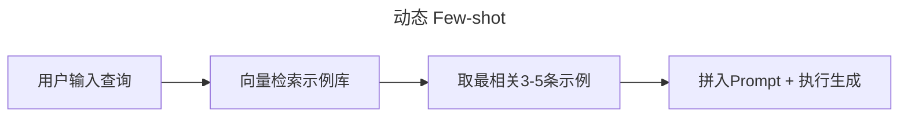
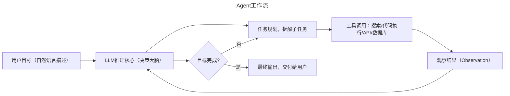
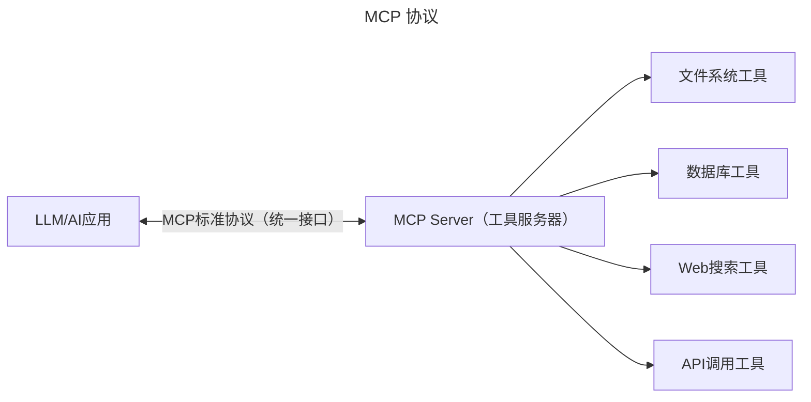
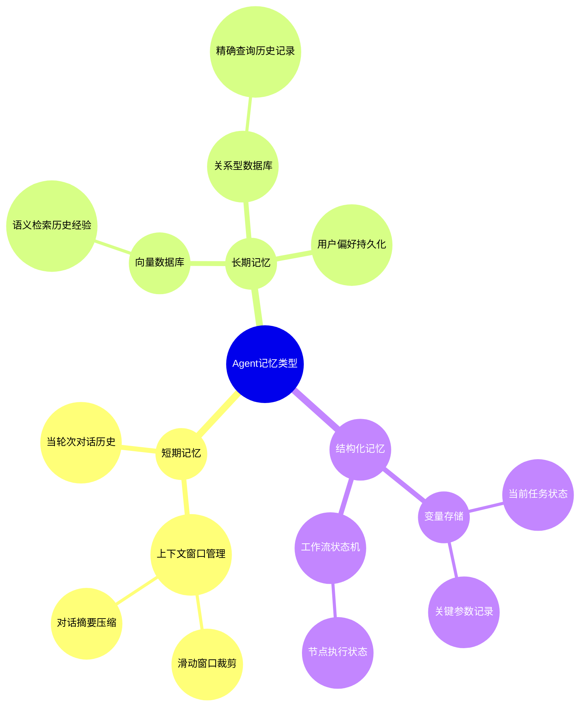
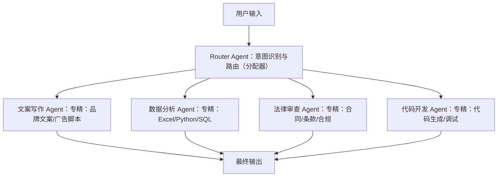
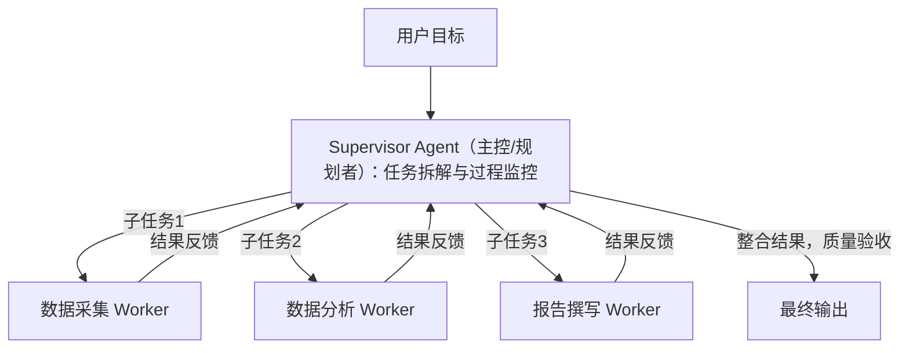

# RAG、Agent与高级商业策略

## 检索增强生成(Retrieval-Augmented Generation, RAG)

### RAG的定义与必要性

**RAG（检索增强生成）** 是一种将外部知识检索与大语言模型生成相结合的AI架构。其核心思想是：在LLM生成回答之前，先从外部知识库中检索与当前问题最相关的内容，将检索结果作为附加上下文（Context）注入到Prompt中，再由LLM综合知识库内容和自身语言能力生成最终答案。

**为什么需要RAG？**

| 局限性                | 原生LLM的问题                        | RAG的解决方式                                   |
| :-------------------- | :----------------------------------- | :---------------------------------------------- |
| 知识截止              | 训练数据有时间截止，无法回答最新事件 | 知识库可实时更新，始终检索最新内容              |
| 企业私域知识          | LLM不知道企业内部文档/产品手册/合同  | 将私有文档导入知识库，检索后注入上下文          |
| 幻觉（Hallucination） | LLM可能对特定领域事实进行猜测编造    | 限制LLM"仅基于已提供的资料作答"，幻觉率显著降低 |
| 知识溯源困难          | LLM无法说明答案来自哪里              | RAG可返回具体来源文档和段落，支持引用溯源       |

### RAG的架构与工作流


**关键组件详解**：

- **文档分块（Chunking）**：将长文档按合适粒度切分成片段（通常500~1000 Token/片）。分块策略直接影响检索质量——太小会丢失上下文，太大会降低检索精度，且超过LLM上下文窗口
- **Embedding模型**：将文本片段转换为高维向量（如768维、1536维）。语义相近的文本在向量空间中距离较近。Query和文档需使用同一个Embedding模型确保语义一致性
- **向量数据库（Vector DB）**：专为高效处理向量相似度搜索而优化的数据库引擎，支持余弦相似度、欧氏距离等相似度计算，能在毫秒级完成百万级文档的语义搜索
- **Top-K检索**：检索与Query向量最相似的K个文档片段（通常K=3~5），作为LLM的参考上下文

### RAG专用的Prompt设计策略

在RAG系统中，Prompt设计需要解决以下核心问题：

**问题1：如何防止LLM"超越资料作答"（即幻觉回退）？**

明确限制LLM的知识来源：

```
你是一位专业的知识库助手。你的所有回答必须仅基于下方提供的参考资料。
如果参考资料中没有足够信息回答用户问题，请直接说"根据现有资料，无法回答此问题"，
不要推断或补充资料中未出现的内容。

[参考资料]
{retrieved_chunks}

[用户问题]
{user_query}
```

**问题2：如何要求LLM为答案添加引用来源？**

```
回答用户问题时，请在每个关键事实或观点后，用括号标注来源文档编号（如[文档2第3段]）。
最终答案后附上参考文献列表。
```

**问题3：如何处理多文档存在矛盾的情况？**

```
如果参考资料中的不同文档对同一问题给出了不同说法，请：
① 明确指出存在矛盾
② 分别说明每个文档的立场
③ 建议用户参考更权威的信息来源进行核实
```

### RAG的能力边界与适用场景

| 场景                               | RAG适合？        | 原因                          |
| :--------------------------------- | :--------------- | :---------------------------- |
| 企业内部知识问答（客服、员工手册） | ✅ 非常适合       | 文档化知识、需要追溯来源      |
| 法律法规查询                       | ✅ 适合           | 精确引用法条比LLM记忆更可靠   |
| 实时新闻摘要                       | ⚠️ 需实时爬取新闻 | RAG知识库需配套实时更新管道   |
| 创意写作/头脑风暴                  | ❌ 不需要         | 检索反而限制创意发散          |
| 复杂多步逻辑推理                   | ⚠️ 需结合Agent    | 单纯RAG检索无法支持复杂推理链 |

### 精确标识符检索：全文检索 vs 向量检索

**场景**：知识库中同时存在型号"XJ-2000-V1"和"XJ-2000-V2"两款产品。用户问"XJ-2000-V2的保修政策是什么？"

向量检索会计算两个型号的语义相似度——由于它们字面极为接近，余弦值可能都很高，导致V1和V2的文档**同时被召回**，生成混乱的回答。

**工程原则**：

| 检索场景                         | 推荐方法                          | 原因                         |
| :------------------------------- | :-------------------------------- | :--------------------------- |
| 语义问题（"这款手机有哪些功能"） | **向量检索**                      | 需要理解语义相似性           |
| 精确型号 / 产品编号 / 版本号     | **全文检索（BM25/关键词匹配）**   | 精确字符串匹配，无误召回风险 |
| 混合场景（大多数商业RAG）        | **混合检索（向量+全文加权融合）** | 兼顾语义理解与精确召回       |

### 多轮对话中的指代消解(Query Rewriting)

**问题**：用户第1轮问"Mate60有现货吗？"，第2轮接着问"它支持卫星通话吗？"

如果直接把"它支持卫星通话吗？"丢入向量检索，会召回所有关于"卫星通话"的文档，而非Mate60的相关内容——因为检索层不知道"它"指代的是Mate60

**解决方案：检索前强制执行 Query Rewriting（指代消解）**

```
用户历史：[{"role":"user","content":"Mate60有现货吗？"},{"role":"assistant","content":"..."}]
当前问题：它支持卫星通话吗？

→ 系统在检索前，先调用LLM改写：
   改写结果：Mate60手机支持卫星通话吗？
→ 用改写后的问题去检索
→ 检索结果喂给生成节点
```

注意：历史对话信息必须在**检索阶段**可见，而不是只在**生成阶段**传入

### 动态Few-shot(Dynamic Few-shot Retrieval)

**背景**：Text-to-SQL、代码生成、结构化输出等任务的质量高度依赖示例（例子写得好，SQL就写得准确）。但企业积累的高质量示例库可能有数百条，全部塞入Context会超出Token窗口

**动态Few-shot策略**：




1. 将所有历史示例（问题+SQL对）存入向量数据库
2. 每次用户提问，先检索最相关的3-5条示例
3. 仅将这些示例拼入当前Prompt，其余丢弃
4. 模型生成时参考精准对口的示例，而非"一锅烩"

> **辨析**：静态Few-shot = 每次都用固定的例子（适用于示例数量少且覆盖范围均匀）；动态Few-shot = 按查询内容实时选例子（适用于示例库大、领域多样的生产系统）

## 智能体(Agent)架构

### Agent的定义与基本结构

**智能体（Agent）** 是指具备"感知-推理-行动"能力的AI系统：它能接收环境信息（用户指令、工具返回结果）、调用外部工具/API执行真实操作，并根据执行结果调整下一步行动，直至完成目标任务

> **Agent与普通LLM调用的根本区别**：普通LLM调用是"一问一答"的单次请求响应；Agent是具备反馈循环、工具调用能力和目标导向的持续决策系统——它能"自主行动"而非仅"生成文本"



### ReAct模式(Reason+Act)

**ReAct（Reasoning + Acting）** 是Agent的主流决策模式，由普林斯顿大学2022年提出。其核心架构将推理（Reasoning）与行动（Acting）交织成循环：

```
Thought（思考）：我需要找到X公司2025年Q3的营收数据
Action（行动）：search_tool("X公司 2025年Q3 营收")
Observation（观察）：工具返回："X公司2025年Q3营收为148亿，同比增长23%"
Thought（思考）：我已获得所需数据，现在可以计算增速并给出结论
Action（行动）：finish("X公司2025年Q3营收148亿，同比增长23%，超出市场预期...")
```

**ReAct的优势**：思考过程透明可追溯；每步行动基于实际观察而非猜测；出错时可从错误步骤继续而非重新开始

> **⚠️ 精确理解ReAct（高频选择题陷阱）**
>
> | 说法                                              | 正确？                                         |
> | :------------------------------------------------ | :--------------------------------------------- |
> | ReAct是Thought→Action→Observation的**串行**循环   | ✅ 正确                                         |
> | 同时并行调用多个工具就是ReAct                     | ❌ 错误（是另一种并行策略，非经典ReAct）        |
> | 只使用思维链（CoT）推理但没有调用外部工具 = ReAct | ❌ 错误（ReAct必须有外部工具交互的Observation） |
> | ReAct中的Observation来自Agent自身的推断           | ❌ 错误（来自真实的**工具调用结果**）           |

### Function Calling(函数调用)

**Function Calling** 是主流LLM API（OpenAI API、Claude API、智谱API等）提供的能力，允许开发者在API调用时声明可供模型调用的函数列表（函数名、参数说明、返回值类型），由模型根据对话内容自动决策"是否调用函数"及"调用哪个函数并传入什么参数"

```
开发者预先声明：
{
  "name": "get_weather",
  "description": "获取指定城市当前天气",
  "parameters": {
    "city": "城市名称（字符串）",
    "unit": "温度单位 celsius 或 fahrenheit"
  }
}

用户输入："今天上海适合穿什么？"

→ 模型自动生成：
{
  "function_call": "get_weather",
  "parameters": {"city": "上海", "unit": "celsius"}
}
```

Function Calling的价值：将LLM的自然语言理解能力与程序端的任意API（数据库/天气/搜索/支付）相连接，将AI从"文字生成工具"升级为"行动导向的服务集成者"

### MCP协议(Model Context Protocol)

**MCP（Model Context Protocol）** 是由Anthropic于2024年提出的开放协议标准，旨在解决AI模型与外部工具集成的碎片化问题

**问题根源**：在MCP出现前，每家AI的Function Calling实现方式各不相同，同一个外部工具（如数据库查询API）若要支持多个AI平台（Claude/GPT/Gemini），需要为每个平台单独开发适配层，维护成本极高

**MCP的解决方案**：定义了一套标准化的通信协议：



**MCP vs Function Calling 的关键区别**：

| 维度         | Function Calling     | MCP                                     |
| :----------- | :------------------- | :-------------------------------------- |
| 定义方       | 各AI平台各自定义     | Anthropic提出的开放标准                 |
| 兼容性       | 平台专属，不可复用   | 任何支持MCP的模型都可调用同一MCP Server |
| 工具开发方式 | 为每个平台单独适配   | 开发一次MCP Server，多平台通用          |
| 典型使用场景 | 单一AI平台的工具集成 | 跨平台工具生态建设                      |

### 记忆类型

Agent要实现跨对话的连续工作能力，需要依赖不同类型的记忆机制：




| 记忆类型       | 存储位置                    | 特点                             | 典型用途                         |
| :------------- | :-------------------------- | :------------------------------- | :------------------------------- |
| **短期记忆**   | LLM上下文窗口               | 临时、有容量上限、对话结束后消失 | 当轮对话历史、当前工具执行结果   |
| **长期记忆**   | 外部数据库（向量DB/关系DB） | 持久化、跨对话、可检索           | 用户偏好、历史工作经验、知识积累 |
| **结构化记忆** | 程序变量/状态机             | 精确、可程序化读写               | 任务状态跟踪、关键参数传递       |

### 工作流型Agent的节点类型

基于可视化工作流平台（如Dify、Coze、FastGPT）构建Agent时，workflow由以下标准节点组成：

| 节点类型                          | 功能                 | 说明                                          |
| :-------------------------------- | :------------------- | :-------------------------------------------- |
| **开始节点（Start）**             | 工作流入口           | 定义工作流的触发条件和输入变量                |
| **LLM节点**                       | 调用大语言模型       | 配置System Prompt、连接上下文变量             |
| **工具节点（Tool）**              | 调用外部API/Function | 搜索、代码执行、数据库查询等                  |
| **IF-ELSE节点**                   | 条件分支             | 根据变量值或LLM输出走不同分支路径             |
| **循环节点（Loop）**              | 迭代处理             | 对列表中的每项重复执行同一流程                |
| **问询节点（Human-in-the-Loop）** | 中断等待人工确认     | 在高风险步骤前暂停，等待用户/审批人确认后继续 |
| **结束节点（End）**               | 工作流出口           | 定义最终输出格式和返回内容                    |

**Human-in-the-Loop（人机协作节点）的重要性**：

在企业级自动化工作流中，对于以下场景**必须**设置人机协作节点：

- 向客户发送大额报价或合同前
- 执行数据删除或不可逆操作前
- AI生成的内容涉及法律/合规风险时
- 自动化流程第一次处理新类型任务时

### 工具描述的重要性(Tool Description as High-Priority Prompt)

模型在规划"应该调用哪个工具、何时调用"时，**工具描述文本是最直接的参考依据**

**生产级工程原则**：对于高风险工具（如退款操作、数据删除等不可逆行为），约束条件必须写入**工具描述**，而不能只依赖System Prompt

❌ **错误做法**（约束写在System Prompt）：

```
System Prompt: 只有在查询退款政策后确认符合条件，才能执行退款操作。

工具描述: execute_refund(order_id, amount) - 向用户退款
```

> 风险：模型可能在特定对话轨迹下，忽视System Prompt而直接调用工具

✅ **正确做法**（约束写在工具描述）：

```
工具描述: execute_refund(order_id, amount) 
- 【重要】仅在已调用 query_refund_policy 确认符合退款条件后方可调用本工具
- 未经政策确认直接调用视为操作违规
```

### Workflow-based Agent vs Prompt-based Agent

两类Agent构建方式的核心区别不是"有无工具调用"，而是**决策路径如何确定**：

| 维度     | Workflow-based Agent           | Prompt-based Agent                 |
| :------- | :----------------------------- | :--------------------------------- |
| 决策路径 | 预定义固定工作流（节点图/DAG） | 由LLM自主规划路径                  |
| 可控性   | 高（可审计每个节点的输入输出） | 低（路径不确定）                   |
| 灵活性   | 低（新需求需改图）             | 高（可适应未见过的任务）           |
| 适用场景 | 金融操作、合规流程、多节点审批 | 多跳检索、开放式研究、动态任务分解 |
| 出错风险 | 风险可预测和控制               | 可能产生幻觉性路径                 |

**工程选型原则**：后果越不可逆（涉及资金流、数据删除、外部API副作用），越应优先选择**Workflow-based**；任务越开放探索性，越适合**Prompt-based**

### Reflection(反思机制)：防止Agent死循环

**问题场景**：工作流型Agent中设有"质量检查→评分不足则重写"的循环节点。如果模型没有从上一轮失败中获得差异化信息，会反复生成相同质量的内容，形成**无效死循环**

> ❌ 错误认知：调高Temperature可以解决死循环 ✅ 正确方案：使用 **Reflection节点**注入失败记忆

**Reflection机制的三步工程实现**：

```
第1步：收集上轮失败信息
  - 上一轮的输出内容
  - 质检节点的具体反馈（哪里扣分了，为什么）
  - 历次失败记录（防止"已经改过"的重复错误）

第2步：强制输出修改计划（Revision Plan）
  System: 根据以下失败记录，先输出你的修改方案，列明："上次哪里错了"+"这次具体改什么"
  （不允许直接输出内容，必须先输出计划）

第3步：按修改计划执行重写
  基于计划生成新版本，再次送入质检节点
```

**关键原理**：Reflection让模型在"本轮经验"的基础上迭代，而非每次从同一起点出发——这才是Agent能够"从错误中学习"的工程基础

| 方案                      | 能解决死循环？ | 原因                         |
| :------------------------ | :------------- | :--------------------------- |
| 仅调高Temperature         | ❌              | 增加随机性，不保证方向正确   |
| 设置最大循环次数上限      | ⚠️ 治标         | 只是强制停止，不解决根因     |
| **Reflection + 修改计划** | ✅ 根治         | 让模型在差异化信息基础上迭代 |

## Skills Based Agent(技能型智能体)

### Skills Based Agent的核心概念

**Skills Based Agent** 是一种以"技能（Skill）"为最小打包单位的Agent构建范式。每个技能是一个独立、可复用的智能体功能单元，拥有明确的职责范围、调用方式和操作规范，可被组合编排成更复杂的智能体系统

### SKILL.md的编写规范

SKILL.md是每个技能单元的核心文档，规范化记录技能的完整信息，使AI能够理解并正确调用该技能。一个标准SKILL.md包含以下必须字段：

| 字段         | 英文名        | 作用                                |
| :----------- | :------------ | :---------------------------------- |
| **技能名称** | Skill Name    | 唯一标识符，清晰描述技能功能        |
| **技能描述** | Description   | 1-2句话说明技能的核心用途和输出类型 |
| **调用指南** | Usage Guide   | 何时应该调用此技能、前置条件        |
| **技能逻辑** | Logic         | 技能内部的执行步骤和决策规则        |
| **参数定义** | Parameters    | 输入参数名称、类型、是否必填、说明  |
| **输出格式** | Output Format | 技能的返回内容的格式和结构说明      |
| **示例**     | Examples      | 1-3个完整的调用/输出示例            |

**SKILL.md模板结构预览**：

```
# Skill: 竞品分析报告生成

## 描述
基于给定公司名称，自动检索并生成结构化竞品分析报告，
输出包括：产品定位、核心功能对比、用户定位差异、优劣势总结。

## 调用指南
当用户需要了解特定竞争对手的产品情况时调用。
需要联网搜索权限。

## 技能逻辑
1. 使用搜索工具检索竞品官网、产品更新日志、用户评价
2. 提取并分类信息（功能/定价/用户群体/差异化）
3. 生成结构化对比报告

## 参数
- competitor_name (string, 必填): 竞品公司或产品名称
- analysis_depth (string, 可选): "brief"(摘要) 或 "full"(完整)，默认 "brief"

## 输出格式
Markdown格式的结构化报告，包含产品概况/核心功能/优劣势三级标题
```

### 技能单元的标准文件结构

一个完整的"技能单元包（Skill Package）"通常包含以下文件：

```
my-skill/
├── SKILL.md              # 必须：指令 + 元数据（Required: instructions + metadata）
├── scripts/        # 可选：可执行代码（Optional: executable code）
├── references/           # 可选：文档（Optional: documentation）
└── assets/         # 可选：模板、资源（Optional: templates, resources）
```

这种标准化结构的价值：

1. **可被程序自动发现和调用**：Agent系统可扫描技能目录，自动将所有技能注册到Available Tools列表
2. **可被人类快速理解**：新成员查看SKILL.md可以在5分钟内理解该技能的功能和用法
3. **支持版本管理**：技能包可通过Git进行版本控制，团队协作迭代

## 多智能体协作(Multi-Agent)

### 为什么需要多智能体

单一Agent存在以下局限：

- **上下文窗口有限**：复杂项目的所有信息无法装入单个Agent的上下文窗口
- **技能专业化不足**：单一通用Agent的专业深度不及专门训练/配置的专业Agent
- **并行执行效率低**：多个独立任务由单一Agent串行完成，耗时是并行多Agent的N倍

多智能体协作（Multi-Agent Collaboration）通过多个专业Agent分工协作，克服上述局限

### Router模式(路由模式)



**Router模式的核心机制**：

1. 用户的输入首先进入Router Agent
2. Router Agent对用户意图进行分类（基于规则或LLM意图识别）
3. Router将任务分发至最匹配的专业Agent执行
4. 专业Agent完成任务后，结果汇总返回用户

**适用场景**：用户的需求类型清晰可分类，且不同类别任务需要明显不同的专业能力（如多功能客服系统、企业内部任务管理平台）

### Supervisor模式(监督者模式)



**Supervisor模式的核心机制**：

1. Supervisor Agent接收用户的高层目标，自主将其拆解为子任务
2. 将子任务分配给专职Worker Agent（并行或顺序执行）
3. 接收Worker的汇报，检查结果质量，必要时要求返工或调整策略
4. 整合所有Worker的成果，输出完整的最终交付物

**与Router模式的根本区别**：

| 维度     | Router模式           | Supervisor模式                     |
| :------- | :------------------- | :--------------------------------- |
| 任务关系 | 并列（各自独立完成） | 协作（有依赖关系，Supervisor统筹） |
| 协调逻辑 | 无协调，各走各的路   | Supervisor持续监控并协调           |
| 适用场景 | 清晰分类的独立任务   | 需要多步骤协作的复杂项目           |
| 典型示例 | 多功能客服分流       | 市场研究报告自动化生成             |
