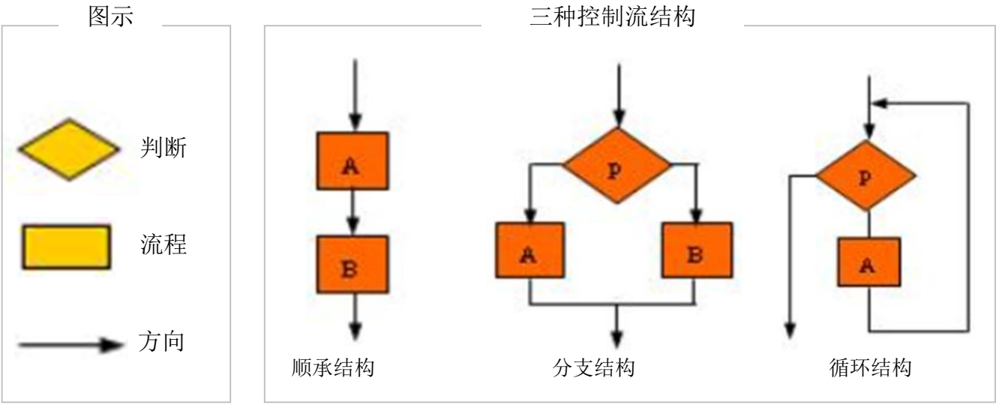
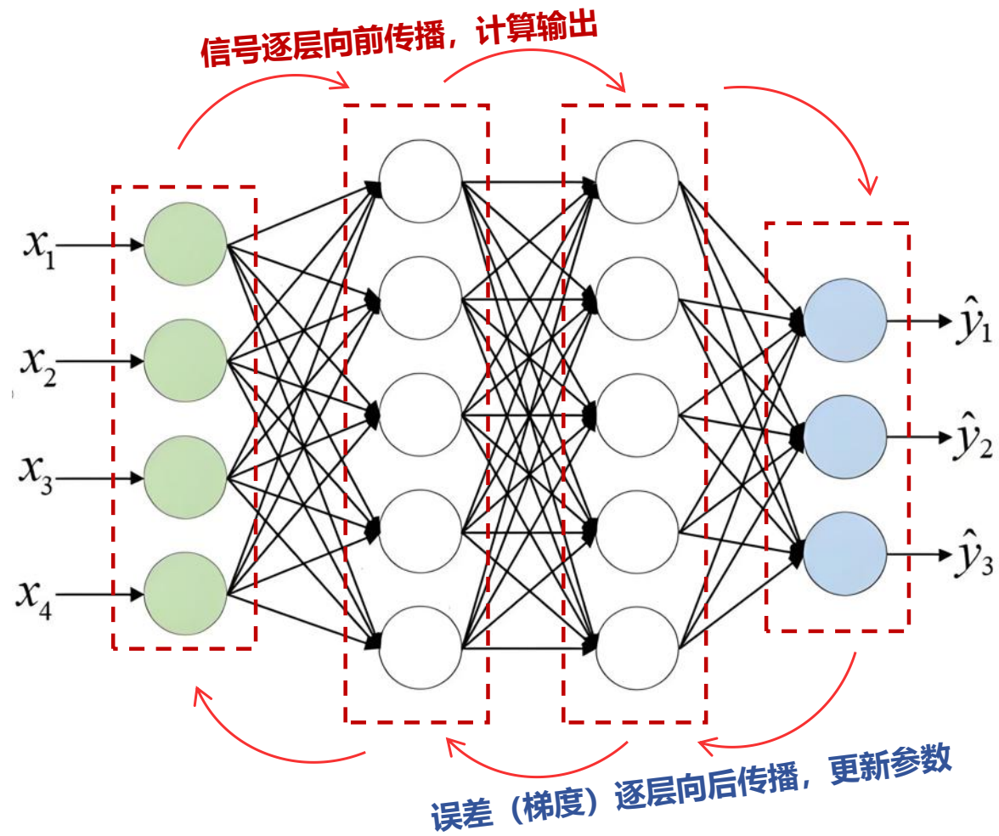
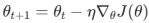
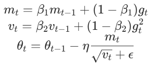
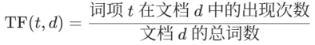
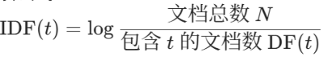
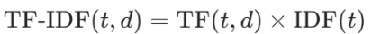

# 03_人工智能算法

## Python编程基础

### Python基础数据类型与表达式

1. Python包含6种核心数据类型：

   1. 字符串：用引号定义，支持单/双/三引号，可通过转义字符处理特殊符号，支持子字符串运算和格式化输出

   2. 数值类型：

      - 整数（int）：任意大小，支持负数

      - 浮点数（float）：含科学计数法（如1.5e2）和无穷大（inf）

      - 布尔值：True/False，可视为特殊数值（True=1, False=0），支持逻辑运算（and/or/not）

      - 日期时间：需通过time/datetime模块处理，时间戳以1970年1月1日为基准

      - 空值：None表示空对象，与pandas中的NaN不同

      - 复数：complex类型

2. 表达式由运算符和操作数构成，支持算术、比较、逻辑三类常见运算

### Python原生数据结构

1. 列表（list）：
   1. 有序可变集合，用[]定义，元素类型可混合
   2. 支持增删改查、索引切片、计数定位等操作

2. 元组（tuple）：
   1. 不可变列表，用()定义，无增删改权限
   2. 优势：代码安全性高，可作字典键（若元素全不可变）

3. 集合（set）：
   1. 无序不重复集合，用set()创建
   2. 核心功能：去重、集合运算（交/并/差）

4. 字典（dict）：
   1. 键值对存储，用{}定义，查找效率极高
   2. 键必须不可变（字符串/数字等），值可为任意类型
   3. 字典转列表需调用.keys()/.values()
   4. 用zip()将列表/元组“缝合”为字典（如dict(zip(['A','B'],[1, 2]))）

### Python控制流

1. 顺序结构：默认自上而下执行，支持分号分隔多语句

2. 分支结构：
   1. if-elif-else实现条件判断
   2. 缩进（建议4空格）定义代码块，无花括号

3. 循环结构：
   1. while循环：带else可选块
   2. for循环：遍历集合（列表/字典等），支持else
   3. 循环控制：break（终止循环）、continue（跳过本次）

4. 列表生成式：
   1. 高效创建列表，支持条件过滤（如[x*2 for x in range(10) if x%2==0]）
   2. 可嵌套多层循环实现全排列

### Python函数、类与常见包

1. 函数定义：
   1. def创建函数，return返回值（无return默认返回None）
   2. 参数灵活：必选/默认/可变/关键字参数

2. 高阶函数：
   1. 函数作参数（如map()/filter()）
   2. 函数名视为变量，可动态传递

3. 匿名函数：
   1. lambda定义单行函数（如lambda x: x*2）
   2. 适用简单逻辑，常作高阶函数参数

4. 面向对象编程（类）：
   1. 类的定义与实例化
   2. 封装、继承与多态

5. 常用包：
   1. 数据处理：pandas（DataFrame读写）
   2. 科学计算：numpy（数组）、scipy（统计）
   3. 机器学习：scikit-learn（模型训练）
   4. 可视化：matplotlib/seaborn

6. 模块化开发通过import导入（如import pandas as pd），提升代码复用性

## 神经网络概念和感知器

### 神经网络概念和感知器

1. 神经网络基本概念

神经网络是一种模拟生物神经元连接方式的计算模型，其核心思想是通过多个神经元组成的多层结构，在输入与输出之间构建复杂的非线性映射关系。一个标准神经元接收来自前一层的输入信号，每个输入带有一个权重，所有输入加权求和后再通过激活函数进行非线性变换，输出结果供下一层使用

感知器是再早出现的单层结构的神经网络，可以实现线性可分的逻辑运算。多层感知器为突破单层感知器的局限，引入隐藏层形成多层感知器（MLP）。隐藏层通过非线性激活函数（如Sigmoid、ReLU）实现复杂决策边界

在多层结构（MLP）中，最常见的是前馈神经网络（Feedforward Neural Network），以BP神经网络为代表，包括输入层、一个或多个隐藏层以及输出层。每一层的参数通过反向传播算法不断更新，目标是最小化模型的预测误差

MLP的层数和神经元数量决定模型表达能力，但层数过多可能导致梯度消失或过拟合

2. 感知器概念

感知器（Perceptron）是1957年由Frank Rosenblatt提出的单层神经网络模型，采用阈值激活函数进行二元分类（输出0或1）。其核心局限在于仅能解决线性可分问题（如AND/OR逻辑），无法处理非线性问题（如XOR异或问题）。当数据线性不可分时，感知器无法收敛，这被称为“感知器的极限”

3. 感知器的组成
   1. 组合函数（Combination Function）：对输入向量进行加权求和，计算加权输入信号。
   2. 激活函数（Activation Function）：阶跃函数或符号函数，将加权和映射为离散输出（如≥0输出1，否则输出-1）。偏置项（bias）作为可学习参数，调整激活阈值

### BP神经网络算法

1. BP神经网络的架构方式：BP神经网络采用全连接前馈结构，包含输入层、隐藏层和输出层。隐藏层通过非线性变换提取特征，输出层生成预测结果。网络深度和宽度需根据任务复杂度调整，例如图像识别需更深网络捕捉空间特征

2. 训练过程包括以下几个步骤：
   1. 前向传播：将输入信号逐层传递，最终输出预测结果
   2. 损失计算：衡量预测值与真实标签之间的差异
   3. 反向传播：通过链式法则求导，逐层计算梯度
   4. 权重更新：利用优化算法（如SGD或Adam）调整模型参数，使损失函数下降。

3. 与回归模型的关系
   1. 线性回归：无隐藏层且输出层使用线性函数的BP网络等价于线性回归。
   2. 逻辑回归：无隐藏层且输出层使用Sigmoid函数的BP网络等价于逻辑回归。

### 神经网络参数求解中常见优化算法

1. 神经网络优化中的挑战：神经网络训练面临局部极小值问题（非凸损失函数存在多个次优解）、梯度消失/爆炸（深层网络中反向传播时梯度指数级衰减或增长），以及长期依赖问题（RNN难以学习长序列的时间关联）。这些挑战需通过优化算法和结构设计缓解。
2. 基于梯度的优化方法：梯度下降通过计算损失函数对参数的梯度（偏导数），沿负梯度方向迭代更新参数以最小化损失。其核心公式为：
   其中 η为学习率，控制步长。但全局梯度下降计算开销大，适用于小规模数据

3. 随机梯度下降与小批量梯度下降
   1. 随机梯度下降（SGD）：每次随机选一个样本计算梯度，更新频率高但波动大，易逃离局部极小值
   2. 小批量梯度下降：折中方案，将数据分为多个批次（如32/64样本），每批计算平均梯度后更新。平衡计算效率与稳定性，是深度学习主流方法

4. 二阶近似方法：牛顿法等二阶方法利用Hessian矩阵（二阶导数）加速收敛，但计算逆矩阵复杂度达 O(n3)，不适用于高参数量模型。常用近似方法如L-BFGS在中小规模模型中仍有应用

5. 自适应学习率算法

   Adam：结合动量（一阶矩估计）和自适应学习率（二阶矩估计），公式为：

   其自适应调节学习率的特点使其成为大模型训练标配。变种如AdamW加入权重衰减提升泛化能力。

6. 前沿优化算法
   1. Sophia：使用梯度曲率替代方差归一化，加速训练收敛
   2. 混合精度训练（FP16/BF16）减少显存占用
   3. 零冗余优化器（ZeRO） 通过参数分区降低分布式训练内存开销

## 深度学习和强化学习

### 深度学习的基本概念

1. 深度学习与传统神经网络的区别
   1. 传统神经网络结构较浅，主要依赖单层或少层网络处理数据，适用于简单任务（如手写数字识别等）。这类模型通常依赖特征工程，即人为设计输入特征，模型仅用于分类器或回归器的角色
   2. 相比之下，深度学习采用多层结构（通常超过3层），具有端到端学习能力。模型不仅执行任务本身，还能自动从原始数据中提取有用特征，实现从数据到结果的全流程自动优化。这使得深度学习在图像识别、语音识别、自然语言处理等复杂任务中远超传统方法
   3. 此外，深度学习具有高度的扩展性和模块化，能够结合不同模型结构（如CNN、RNN、Transformer），融合多模态数据，支持多任务学习。

2. 深度学习为何能解决更复杂的问题
   1. 深度学习模型本质上是一种可组合函数的嵌套结构，其深层网络设计使模型具备逐层抽象的能力。底层网络提取低级特征（如边缘、轮廓），中间层抽象中级结构（如图形组合、局部模式），高层网络则学习语义级表示（如类别、情感、主题等）
   2. 通过多层非线性变换，深度学习能够拟合复杂函数、捕捉多变量之间的非线性关系，适应高维、非结构化、带噪声的数据输入。尤其在缺乏领域知识支持的情况下，深度学习的自动特征提取能力尤为关键

### 卷积神经网络（CNN）

1. 高维结构化数据建模挑战

图像、视频、医学影像等数据具有显著的空间结构特征，像素点之间存在局部相关性，特征具有局部性、层次性和稀疏性。传统全连接网络忽略这种结构，导致参数维度激增、训练效率低、过拟合风险高

2. CNN基本机制与核心设计

   1. CNN通过引入卷积操作与池化机制，有效保留图像结构并压缩计算复杂度。其基本组成包括：

      - 卷积层：通过多个小型卷积核滑动提取局部特征。卷积核具有共享权重机制，能自动学习边缘、纹理、形状等模式

      - 激活函数（如ReLU）：引入非线性变换，增强模型表达能力；

      - 池化层：通过最大池化或平均池化降低特征图尺寸，提升模型的平移不变性；

      - 全连接层：用于最终分类或回归任务。

   2. CNN的特征在于局部连接、权值共享与空间层次建模，从而在保持结构信息的同时大幅减少参数量

3. CNN在图像处理中的优势

在图像识别任务中，CNN能自动构建从低级边缘特征到高级语义表示的多层特征图结构。通过多层堆叠，逐步实现图像的语义抽象与分类判定。与传统SIFT、HOG等手工特征相比，CNN在特征提取的精度和泛化能力上优势明显

### 循环神经网络

1. 序列建模的挑战
   1. 与静态数据（如图像）不同，序列数据（如文本、语音、时间序列）具有天然的时间顺序和上下文依赖性。模型在处理当前输入时，往往需要参考前文信息。传统前馈神经网络将每个输入样本视为独立个体，忽视了时间上的联系，因而难以胜任此类任务
   2. 此外，序列数据还面临“长期依赖问题”：模型需要从当前时刻回溯到很久之前的信息，而传统RNN在多步传播中容易出现梯度消失或爆炸，导致远程信息丧失

2. RNN结构与建模能力
   1. RNN专为序列建模设计。其核心在于引入隐藏状态，使模型在每个时间步接收当前输入及前一时间步的隐藏状态，实现信息的时序累积
   2. 在展开图中，每个时间步对应一个RNN单元，所有时间步共享参数，使模型具备时间不变性和强泛化能力。通过这种机制，RNN可以学习语言的上下文关系、行为模式的动态演化、时间序列的趋势波动等。

3. LSTM机制及优势

   为解决传统RNN难以捕捉长期依赖的问题，LSTM网络引入“门控机制”。其核心结构包括：

   - 遗忘门：决定哪些历史信息应被丢弃
   - 输入门：控制当前输入信息写入记忆的程度
   - 输出门：决定从记忆单元中提取哪些信息输出

   通过这些门控的有机配合，LSTM能够“记住重要信息、忘掉冗余信息”，大大提升了对长序列的建模能力

4. 实际应用与业务价值

   LSTM已广泛应用于文本处理（如文本生成、对话建模、语义分析）、语音识别（将连续语音转化为文字）、金融预测（如股价走势）等场景。其时间敏感性、上下文记忆能力，使其成为序列建模的关键基石

### 深度学习中的模型评测与调优

1. 模型训练流程

   深度学习模型的生命周期包括：数据准备 → 模型结构设计 → 模型训练 → 验证与调参 → 测试与评估 → 模型部署 → 上线监控。每一步都可能影响最终性能，调优过程需不断迭代、系统化执行

2. 数据划分与交叉验证

   数据划分是模型评估的基础。常见方式为训练集（用于模型学习）、验证集（用于调参）、测试集（用于性能评估）。在数据量不足时，可采用交叉验证（如K折）提升评估稳定性，避免过拟合

3. 损失函数与优化器选择
   1. 损失函数决定模型优化目标，如分类任务常用交叉熵、回归任务常用均方误差
   2. 优化器如SGD、Momentum、Adam、RMSprop等，用于控制梯度下降的方式和效率，是模型收敛速度与稳定性的关键因素
   3. 损失函数和优化器需根据任务类型、模型结构和数据特点综合选择。

4. 深度学习中的正则化

   1. 参数范数惩罚

      - L1正则化：损失函数中加入权重绝对值之和，促进稀疏解，适用于特征选择

      - L2正则化：加入权重平方和，使参数趋近于零但不稀疏，提升模型平滑性。二者均通过惩罚大权重抑制过拟合

   2. 提前终止：监控验证集损失，当连续多轮未下降时停止训练。本质是隐式限制优化步数，避免训练后期过拟合，同时节省计算资源

   3. Dropout：训练中随机以概率p（如0.5）将神经元输出置零，迫使网络不依赖特定神经元。测试时需缩放输出（乘以 1-p）以保持期望值。其机制等效于集成多个子模型，显著提升泛化能力

5. 模型评价指标
   1. 准确率：整体预测正确的比例
   2. 精确率与召回率：用于不均衡分类场景；
   3. F1值：精确率与召回率的调和平均，更适合反映模型综合性能
   4. ROC曲线与AUC：衡量模型在不同阈值下的分类能力

### 强化学习

1. 强化学习核心机制

   强化学习是一种以序列决策为核心的学习机制，模型与环境持续交互，通过行为影响环境状态并接收奖励，在试错过程中不断优化策略，目标是最大化长期累计回报

2. 强化学习与监督学习对比

   监督学习关注静态输入输出映射，而强化学习面向动态决策优化，更强调反馈与行动后果。强化学习适用于复杂规划、机器人控制、推荐系统优化、博弈对抗等领域，是实现自主智能行为的核心路径

3. RLHF在人类偏好对齐中的应用
   1. RLHF通过人类评审结果构建奖励模型，引导大语言模型（如GPT）学习符合人类价值观、语言习惯与指令意图的行为策略
   2. 这一机制分为：预训练 → 监督微调 → 奖励模型训练 → 策略优化。已成为构建安全、可靠、符合人类期望的大模型的重要手段

## 自然语言处理NLP基础

### 自然语言处理概述

1. 自然语言处理基本概念
   1. 自然语言处理是人工智能的重要研究方向之一，其目标是使计算机能够理解、分析、生成和响应人类使用的自然语言，从而实现高效、自然的人机交互。NLP不仅是AI交互界面的关键入口，也是理解非结构化语言数据、实现知识计算和语言推理的核心技术
   2. NLP的核心任务包括语言理解（如情感分析、实体识别）、语言生成（如自动摘要、对话系统）以及语言转换（如机器翻译）。这些任务背后的共同目标是将自然语言转换为机器可处理的结构化表示，进而支撑更高层次的推理、决策和生成
   3. 自然语言具有歧义性、多义性和强上下文依赖等特性，处理这些问题需要模型具备较强的上下文建模能力和语义抽象能力。传统统计模型受限于规则和特征工程，而现代NLP依赖深度神经网络尤其是Transformer结构进行建模，实现从语料中自动学习语言结构和规律

2. NLP核心目标与应用场景

   1. NLP的根本目标是“弥合人类语言与机器语言之间的鸿沟”，让计算机具备类人类语言的理解和生成能力。通过对自然语言的建模，NLP系统可完成文本分析、信息提取、对话交互等多种任务

   2. 典型应用包括：

      - 情感分析：识别文本中的情绪倾向，广泛应用于用户评价挖掘、舆情监控等

      - 聊天机器人：支撑自动客服、问答系统等智能服务场景

      - 语音识别：将语音转为文本，实现语音助手、车载语音等交互

      - 机器翻译：实现不同语言之间的转换，如Google翻译、DeepL

      - 文本摘要与信息抽取：提升海量文本的信息压缩与结构化能力

3. 自然语言的复杂性
   1. 自然语言中的歧义性、多义性和上下文依赖构成了NLP面临的三大挑战。例如，“苹果”一词可能指水果，也可能指公司，“背”可能是身体部位，也可能是“背诵”，不同语境下含义迥异
   2. 传统方法难以处理这些模糊现象，而现代预训练语言模型（如BERT、GPT）通过大规模语料建模上下文关系，能更准确地判别词义和语境
   3. 理解语言不仅依赖句法结构，更需背景知识与世界知识支持，因而NLP是多层建模与跨领域知识融合的复杂任务

4. NLP与大语言模型的关系
   1. 大语言模型通过大规模无监督预训练掌握了通用语言知识，极大提升了文本分类、问答、翻译、生成等任务的性能，并具备良好的任务迁移能力
   2. 与传统NLP相比，LLM减少了对特征工程的依赖，具备“少样本”“零样本”学习能力，在低资源语言或新任务上同样展现优异性能
   3. 当前的NLP范式正从“特定任务定制模型”向“通用预训练+少量微调”过渡，大模型成为基础能力平台，为NLP在行业中的广泛落地提供了新范式

### 文本处理与分析基础技术

1. 基础语言处理与分析技术
   1. 文本预处理是NLP任务的第一步，主要包括分词、词性标注、命名实体识别和文本分类等。它们提供了语言的结构化表达，构成语法理解和语义建模的底层基础
   2. 分词处理将连续的文本切割为词语单位，词性标注识别每个词在句子中的语法角色，是句法解析的基础；文本分类用于自动化信息归类和过滤，在情感分析、新闻分类等任务中应用广泛
   3. 这些基础模块也是高级NLP模型（如Transformer、BERT）进行语义建模前不可或缺的输入处理步骤

2. 分词与词性标注技术
   1. 分词是中文NLP中不可或缺的步骤，因为中文书写中词与词之间没有明显边界。常用方法包括基于词典和规则的方法（如最大匹配算法）与基于统计学习的方法（如HMM、CRF）
   2. 词性标注用于识别词汇在句子中的语法角色，通常使用序列标注模型如BiLSTM-CRF进行建模。正确的词性标注对于后续的依存句法分析、实体识别等任务有重要影响
   3. 准确的分词与词性标注可显著提升问答系统、情感分析、文本聚类等NLP应用的输入质量

3. 关键词提取
   1. TF（词频，Term Frequency）：词项在文档中出现的频率，用以量化词项在文档中的重要性（如“糖尿病”在医学文献中TF高），公式：

   2. IDF（逆文档频率，Inverse Document Frequency）：衡量词项稀有程度的指标，计算公式：

   3. TF-IDF（词频-逆文档频率）：局部高频（TF高）且全局稀有（IDF高）的词更具表征力，比如在癌症研究文献中，“靶向治疗”的TF-IDF值显著高于通用词“方法”。公式：

4. 文本分类与主题归纳

   1. 文本分类是将文本内容映射至预设类别（如“财经”“科技”“娱乐”）的过程，常用方法包括朴素贝叶斯、SVM、CNN、RNN等

   2. 主题归纳是一种无监督学习方法，旨在发现文本集合中潜在的主题结构，典型模型包括LSA和LDA。它在文档聚类、推荐系统等场景中发挥重要作用

   3. 传统机器学习方法在小样本条件下效果稳定、可解释性强，但对特征依赖较大；而深度学习方法能自动提取语义特征，在大规模文本处理和跨任务迁移方面表现更优

4. 典型NLP任务案例分析

   1. 情感分析案例：通过构建情感分类器，对用户评论、社交媒体发言等文本进行情感倾向识别，企业可据此洞察市场舆情、优化产品设计

   2. 新闻分类案例：将新闻内容自动分配至主题频道，提高信息分发与推荐系统的效率。如财经类新闻自动归类至财经频道

   3. 这些任务流程均包括文本预处理、特征表示和模型预测三个阶段，是构建完整NLP应用系统的通用流程范式

### 文本向量化与语义建模

1. 词向量与语义表示
   1. 词向量是将离散的词语表示为连续的稠密向量，能捕捉词语的语义相似性与语法规律。基于“上下文分布相似”假设，相似语义的词在向量空间中距离更近
   2. 与传统的One-hot编码相比，词向量不仅降低维度，还具备语义运算能力（如“国王”-“男人”+“女人”≈“女王”），为下游模型提供了更丰富的语义基础
   3. 词向量是深度NLP模型的基础构件，其质量直接影响模型的表达能力与推理效果

2. 早期文本向量化技术
   1. One-hot编码存在稀疏、维度灾难、语义缺失等问题
   2. TF-IDF虽然提升了词频衡量精度，但仍然无法表示词义关系和上下文依赖，不适用于捕捉语义层面的关联
   3. 这些技术为后来的分布式词向量方法奠定了概念基础，但已逐渐被更先进的嵌入技术所替代

3. Word2Vec基本原理
   1. Word2Vec包括CBOW（上下文预测中心词）和Skip-Gram（中心词预测上下文）两种结构，是将语境学习嵌入到词向量训练中的有效方法
   2. 通过神经网络训练，将语料中词与其上下文构建预测关系，学习词的表示。Word2Vec通过窗口机制、负采样等手段提升训练效率，在工业界应用广泛

4. 相似度计算与词嵌入可视化
   1. 计算语义相似度常用方法包括余弦相似度（衡量方向相似度）和欧氏距离（衡量空间距离）
   2. 为了直观呈现词语间的语义结构，通常对高维词向量进行降维（如PCA、t-SNE）可视化，从而观察语义聚类现象和概念空间分布

### Transformer原理

1. RNN的局限性
   - 难以并行处理，训练效率低
   - 难以捕捉长距离依赖

2. Transformer的核心机制
   1. Transformer完全摒弃了循环结构，改为使用自注意力机制对序列中所有词进行全局建模，具备良好的并行性与长距离建模能力
   2. 主要结构包括：
      1. 多头注意力：从多个角度捕捉序列中词与词的关系
      2. 位置编码：弥补模型不具备词序信息的缺陷
      3. 残差连接与层归一化：稳定训练过程、缓解梯度问题
      4. 前馈网络：增强特征抽象与非线性表达能力
   3. 通过自注意力机制，Transformer可在一个计算步骤中获得序列所有元素的信息，极大提升模型效率与表现力

3. Transformer的应用与影响
   1. Transformer架构已成为现代NLP的基础，支撑了从BERT（理解型模型）到GPT（生成型模型）的整个语言建模范式的变革
   2. 它在机器翻译、文本生成、摘要、语音识别等任务中取得了突破性进展，也为通用大语言模型的发展提供了结构基础
   3. 随着大模型的发展，Transformer的能力被进一步放大，成为当前多语言、多模态、多任务统一建模的核心技术架构

## 知识图谱和复杂网络

### 知识表示和知识建模

知识表示是将知识转化为计算机可处理的形式，核心方法包括资源描述框架（RDF）和网络本体语言（OWL）。RDF 以三元组（主语、谓语、宾语）表示实体关系（如“小米公司-创始人-雷军”），支持语义网的数据互联；OWL 扩展 RDF，支持类、属性约束和推理规则（如定义“公司”的子类“科技公司”）。知识建模通过本体构建知识体系，例如使用 Protégé 工具定义领域概念（如“企业”“人物”）及其层级关系（继承、互斥），确保知识结构化。实践需结合领域需求，如电商图谱需建模商品属性（价格、类别）和用户关系（购买、评价），以提升数据可解释性和推理效率

### 知识抽取和知识挖掘

1. 知识抽取从多源数据中提取结构化知识：
   1. 实体抽取：识别文本中的命名实体（如“北京小米科技有限责任公司”），方法包括基于规则（词典匹配）和深度学习（BiLSTM-CRF）
   2. 关系抽取：捕获实体间语义（如“雷军-创立-小米”），常用远程监督（对齐知识库与文本）或联合模型（同时抽取实体及关系）
   3. 事件抽取：解析动作及其参与者（如“上市事件：主体=小米，时间=2018年”）

2. 知识挖掘则聚焦深层发现：
   1. 实体链接：消歧指称（如“苹果”指向公司或水果），依赖上下文相似度计算
   2. 规则挖掘：从数据中归纳模式（如“若A创立B且B上市，则A为企业家”），支持知识补全

### 知识存储和知识融合

1. 知识存储需适配图谱特性：
   1. 图数据库（如 Neo4j）：以节点（实体）和边（关系）存储数据，高效支持多跳查询（如“小米的子公司的高管”）
   2. 三元组库（如 Apache Jena）：专为 RDF 设计，优化 SPARQL 查询性能

2. 知识融合解决异构数据整合：
   1. 本体匹配：对齐不同模式的概念（如“总部地点”映射到“总部”），基于语义相似度
   2. 实体对齐：识别跨源等价实体（如“小米集团”与“北京小米科技”），方法包括相似性传播（图结构匹配）或 Embedding 模型（向量空间邻近）

### 知识检索和知识推理

1. 知识检索结合语义理解：
   1. 语义搜索：解析自然语言查询（如“雷军的公司”），转换为结构化查询（SPARQL），返回精准答案（小米公司详情）
   2. 向量检索：使用 Embedding 模型（如 TransE）计算查询与知识相似度，提升召回率

2. 知识推理推导隐含知识：
   1. 规则推理：应用逻辑（如“若A是B子公司，则B控股A”）补全关系
   2. 表示学习：通过嵌入向量预测新关系（如“小米→生态链企业→智米”），支持链接预测

### 复杂网络（图）算法

1. 基础指标：
   1. 度（degree）：节点连接数（如“雷军”度=10，表示关联10个实体）
   2. 最短路径（shortest path）：节点间最小边数（如“雷军→黎万强”路径=1）
   3. 介数（betweenness）：节点被最短路径通过频率（高介数节点如“北京”为关键枢纽）

2. 集中度度量：
   1. 度集中度（Degree centrality）：节点度占比，识别核心节点（如搜索引擎中的“百度”）
   2. 紧密集中度（Closeness centrality）：节点到其他节点的平均距离倒数，衡量信息传播效率
   3. 介数集中度（Betweenness centrality）：节点控制网络流量的能力，用于关键节点检测。

3. 常用算法：
   1. PageRank：基于链接重要性排序（如“小米官网”因高入链获高分），用于实体影响力评估
   2. Louvain 社区发现：迭代优化模块度（社区内紧密度），划分关联紧密的子图（如“小米生态链企业”社区）
